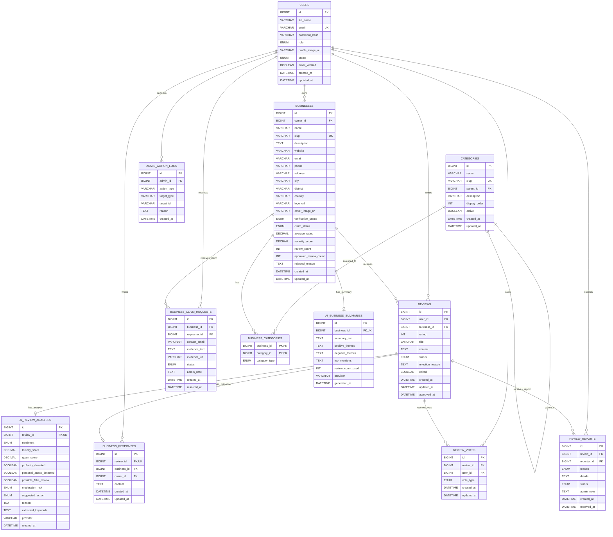

# Veracity ERD

**Document:** 03-erd.md  
**Project:** Veracity  
**Source:** Final Veracity SRS v1.0  
**Purpose:** Database design reference before backend implementation

---

## 1. Design Decisions

For the MVP, Veracity will use a relational MySQL database with Flyway-managed migrations.

### ID Strategy

Use `BIGINT AUTO_INCREMENT` for the MVP unless a later decision is made to use UUIDs. This keeps implementation, debugging, joins, and seed data easier during the 10-day build.

### Naming Strategy

Database table names should use plural snake_case names:

```text
users
categories
businesses
business_categories
reviews
business_responses
review_votes
review_reports
ai_review_analyses
ai_business_summaries
business_claim_requests
admin_action_logs
```

### MVP Entity Scope

Must-build entities:

1. users
2. categories
3. businesses
4. business_categories
5. reviews
6. business_responses
7. ai_review_analyses
8. ai_business_summaries

Should-have / optional entities if time allows:

1. review_votes
2. review_reports
3. business_claim_requests
4. admin_action_logs

---

## 2. Entity Relationship Diagram



---

## 3. Entity Notes

### 3.1 users

Stores all human users.

| Field | Notes |
|---|---|
| role | `CONSUMER`, `BUSINESS_OWNER`, `ADMIN` |
| status | `ACTIVE`, `SUSPENDED`, `DELETED` |
| password_hash | BCrypt hash only. Never expose in API responses. |
| email_verified | Can default to true for MVP or false if simulated verification is added. |

Indexes/constraints:

```sql
UNIQUE(email)
INDEX(role)
INDEX(status)
```

---

### 3.2 categories

Supports parent-child business categories.

| Field | Notes |
|---|---|
| parent_id | Nullable self-reference. Parent category if present. |
| slug | Unique URL-safe identifier. |
| active | Inactive categories should not appear in public filters. |

Indexes/constraints:

```sql
UNIQUE(slug)
INDEX(parent_id)
INDEX(active)
```

---

### 3.3 businesses

Stores public and admin-managed business profiles.

| Field | Notes |
|---|---|
| owner_id | Nullable for unclaimed businesses. |
| verification_status | `DRAFT`, `PENDING_VERIFICATION`, `APPROVED`, `REJECTED`, `SUSPENDED` |
| claim_status | `UNCLAIMED`, `CLAIM_PENDING`, `CLAIMED` |
| average_rating | Cached from approved reviews only. |
| veracity_score | MVP can equal average rating. |
| approved_review_count | Cached count of approved reviews. |

Indexes/constraints:

```sql
UNIQUE(slug)
INDEX(owner_id)
INDEX(verification_status)
INDEX(claim_status)
INDEX(city)
INDEX(district)
INDEX(average_rating)
INDEX(approved_review_count)
```

Recommended duplicate-prevention check:

```text
lower(name) + lower(city) + website
```

This can be implemented as a service-level check first, and strengthened later with normalized fields.

---

### 3.4 business_categories

Join table between businesses and categories.

| Field | Notes |
|---|---|
| category_type | `PRIMARY` or `SECONDARY` |

Rules:

1. A business must have exactly one primary category.
2. A business may have up to three secondary categories.
3. A category cannot be deleted/deactivated recklessly if assigned to businesses.

Implementation note: enforce the exact one-primary and max-three-secondary rules in the service layer for the MVP.

---

### 3.5 reviews

Stores consumer reviews.

| Field | Notes |
|---|---|
| rating | Integer from 1 to 5. |
| status | `PENDING`, `APPROVED`, `REJECTED`, `FLAGGED`, `DELETED` |
| approved_at | Set only when admin approves. |
| edited | True if user edits review. |

Indexes/constraints:

```sql
INDEX(user_id)
INDEX(business_id)
INDEX(status)
INDEX(rating)
INDEX(created_at)
```

Duplicate active review rule:

```text
One active review per user per business.
```

Because MySQL partial unique indexes are limited, enforce this in service logic for MVP. Later improvement can use generated columns or a separate active flag.

---

### 3.6 business_responses

Stores one official response from a business owner per review.

Rules:

1. Only the owner of the reviewed business may respond.
2. One response per review in MVP.
3. Response must be shown under the review publicly.

Indexes/constraints:

```sql
UNIQUE(review_id)
INDEX(business_id)
INDEX(owner_id)
```

---

### 3.7 ai_review_analyses

Stores AI or rule-based moderation result for each review.

Rules:

1. One latest analysis per review in MVP.
2. Provider can be external AI provider or `RULE_BASED`.
3. Admin decision must not be automated solely from AI output.

Indexes/constraints:

```sql
UNIQUE(review_id)
INDEX(moderation_risk)
INDEX(suggested_action)
INDEX(sentiment)
```

---

### 3.8 ai_business_summaries

Stores cached review summary for a business.

Rules:

1. Use approved reviews only.
2. Minimum three approved reviews required by default.
3. Store generated result to avoid repeated AI calls on every page load.

Indexes/constraints:

```sql
UNIQUE(business_id)
INDEX(generated_at)
```

---

### 3.9 business_claim_requests

Optional but useful for the business claiming workflow.

Rules:

1. Business owner submits claim request for unclaimed business.
2. Admin approves or rejects.
3. Approved claim assigns business to requester.

---

### 3.10 admin_action_logs

Optional but recommended for auditability.

Use this only after the core workflows are stable.

---

## 4. Enum Reference

### UserRole

```text
CONSUMER
BUSINESS_OWNER
ADMIN
```

### UserStatus

```text
ACTIVE
SUSPENDED
DELETED
```

### BusinessVerificationStatus

```text
DRAFT
PENDING_VERIFICATION
APPROVED
REJECTED
SUSPENDED
```

### BusinessClaimStatus

```text
UNCLAIMED
CLAIM_PENDING
CLAIMED
```

### BusinessCategoryType

```text
PRIMARY
SECONDARY
```

### ReviewStatus

```text
PENDING
APPROVED
REJECTED
FLAGGED
DELETED
```

### Sentiment

```text
POSITIVE
NEUTRAL
NEGATIVE
MIXED
```

### ModerationRisk

```text
LOW
MEDIUM
HIGH
```

### SuggestedAction

```text
APPROVE
REVIEW_MANUALLY
REJECT
```

### VoteType

```text
HELPFUL
UNHELPFUL
```

### ReportReason

```text
SPAM
ABUSIVE_LANGUAGE
HATE_OR_HARASSMENT
FALSE_INFORMATION
PERSONAL_INFORMATION_EXPOSED
CONFLICT_OF_INTEREST
OTHER
```

### ReportStatus

```text
PENDING
ACCEPTED
DISMISSED
```

---

## 5. Migration Plan

Recommended Flyway migration order:

| Migration | Purpose |
|---|---|
| V1__create_users.sql | Users table and admin seed. |
| V2__create_categories.sql | Category table and seed categories. |
| V3__create_businesses.sql | Business table. |
| V4__create_business_categories.sql | Business-category join table. |
| V5__create_reviews.sql | Review table. |
| V6__create_business_responses.sql | Business response table. |
| V7__create_ai_review_analyses.sql | Review AI moderation results. |
| V8__create_ai_business_summaries.sql | Cached business summaries. |
| V9__create_optional_interactions.sql | Votes, reports, claim requests, audit logs if implemented. |
| V10__seed_demo_data.sql | Demo users, categories, businesses, reviews. |

---

## 6. MVP Simplifications

To finish within 10 days, the following simplifications are acceptable:

1. Use `BIGINT` IDs instead of UUIDs.
2. Use simple SQL `LIKE` search instead of Elasticsearch/full-text engine.
3. Cache business rating statistics in the businesses table.
4. Use service-layer checks for complex business rules.
5. Store extracted keywords/themes as JSON strings or comma-separated text initially.
6. Implement rule-based AI fallback before external AI integration.
7. Implement one response per review.
8. Keep review votes/reports optional unless the core flow finishes early.
